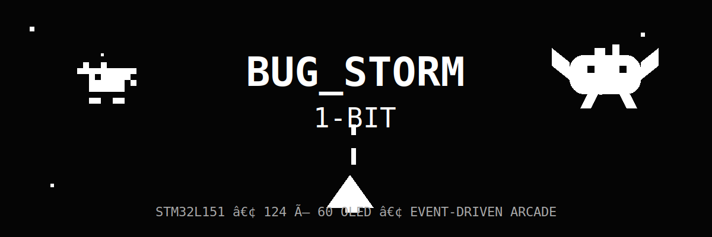
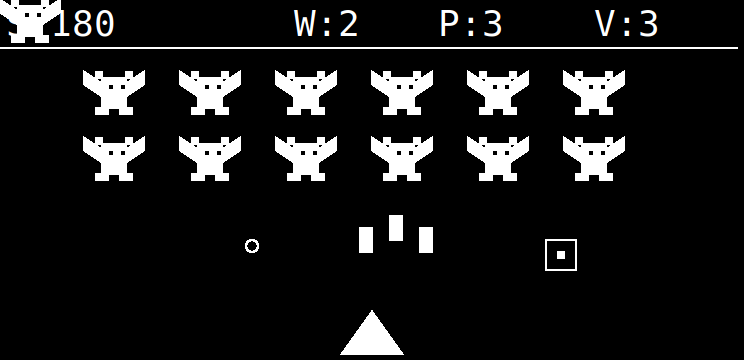
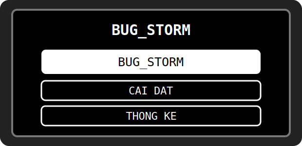
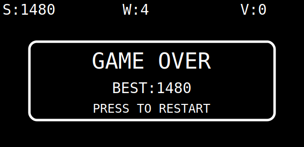

<div align="center">


</div>

# Bug_Storm - Game built on AK Embedded Base Kit
<p align="center">
    <video src="https://github.com/user-attachments/assets/5f5940bc-6679-49d3-95c9-15b6f1957629" controls width="480"></video>
</p>
<p align="center">
  
</p>

---

## Gameplay Preview

<div align="center">
  
</div>

## Documentation

| File | Description |
|---|---|
| [README.md](README.md) | Main project overview, hardware information, gameplay rules and object descriptions. |
| [docs/01-guide-getting-started.md](docs/01-guide-getting-started.md) | Kali Linux toolchain, build, flash and troubleshooting guide. |
| [docs/02-guide-coding-rules.md](docs/02-guide-coding-rules.md) | Coding rules for fixed memory, timing, collision and state management. |
| [docs/03-design-sequence-object.md](docs/03-design-sequence-object.md) | Runtime sequences for Ship, Bullet, Bug, Egg, Gift and Boss. |
| [docs/04-design-sequence-runtime.md](docs/04-design-sequence-runtime.md) | Runtime signal flow for buttons, AK messages, game ticks and rendering. |

## Introduction

**Bug_Storm** is a 1-bit arcade shooter built on top of the **AK Embedded Base Kit**, a hands-on platform for learning event-driven embedded programming. The player controls a spacecraft, destroys formations of flying Bugs, collects firepower Gifts and fights a Boss after every wave.

While developing and playing Bug_Storm, the following embedded concepts are demonstrated:

- **System design:** Modelling gameplay objects and phase transitions.
- **Task communication:** Passing button events through AK signals and messages.
- **Time management:** Running the game with periodic software timers instead of blocking delays.
- **State machines:** Coordinating Formation, Boss, Wave Clear and Game Over states.
- **Memory control:** Reusing fixed-size object pools on an MCU with 16 KB RAM.

### I. Hardware

<table align="center">
  <tr>
    <td align="center"></td>
  </tr>
</table>
<p align="center"><strong><em>Figure 1:</em></strong> AK Embedded Base Kit - STM32L151.</p>

[AK Embedded Base Kit](https://epcb.vn/products/ak-embedded-base-kit-lap-trinh-nhung-vi-dieu-khien-mcu) is an evaluation kit for intermediate and advanced embedded-software learners.

The kit integrates a **1.54-inch monochrome OLED**, **three push buttons** and an **on-board buzzer**, providing a complete interface for event-driven game-machine development. It also exposes RS485, Qwiic and Grove connectors for embedded prototyping.

**MCU overview:**

```text
SoC Name : STM32L151CBT6
CPU      : Arm Cortex-M3
Flash    : 128 KB
RAM      : 16 KB

Flash Partitions
----------------
[ 0x08000000 - 0x08001FFF ] : Bootloader partition (8 KB)
[ 0x08002000 - 0x08002FFF ] : BSF shared partition (4 KB)
[ 0x08003000 - 0x0801FFFF ] : Application partition (116 KB)
                                  Bug_Storm firmware
```

**MCU naming convention:**

| Part | Meaning |
|---|---|
| `STM32` | STMicroelectronics 32-bit MCU family. |
| `L` | Low-power series. |
| `151` | STM32L151 product line. |
| `C` | 48-pin device category. |
| `B` | 128 KB internal Flash. |
| `T` | LQFP package. |
| `6` | Industrial temperature grade. |

<table align="center">
  <tr>
    <td align="center"></td>
  </tr>
</table>
<p align="center"><strong><em>Figure 2:</em></strong> Board view - top and bottom.</p>

### II. Game Description and Objects

Bug_Storm runs on a logical **124 x 60 pixel**, 1-bit framebuffer. The upper 9 pixels display the HUD; the remaining area contains the Bug formation, Boss, projectiles, Gifts and Player Ship.

<table align="center">
  <tr>
    <td align="center"></td>
  </tr>
</table>
<p align="center"><strong><em>Figure 3:</em></strong> Main menu.</p>

The current startup menu contains:

- **Bug_Storm:** Start a new game.
- **Cai dat:** Reserved for future gameplay settings.
- **Thong ke:** Reserved for future score statistics.

<table align="center">
  <tr>
    <td align="center"></td>
  </tr>
</table>
<p align="center"><strong><em>Figure 4:</em></strong> Gameplay screen.</p>

#### Objects in the Game:

| Bitmap | Object Name | Description |
|:---:|---|---|
|  | **Player Ship** | The player spacecraft, positioned at the bottom of the screen. It moves horizontally in 5-pixel steps and fires automatically. The player starts with three lives. |
|  | **Bullet** | A `2 x 4 px` projectile fired upward every 200 ms. Gifts increase the number of simultaneous firing streams from one to four. |
|  | **Bug** | The main enemy. Eighteen Bugs are arranged in 3 rows x 6 columns. The formation moves horizontally, reverses at screen edges and descends toward the Player. |
|  | **Egg** | An enemy projectile dropped by the lowest living Bug in a selected column or from underneath the Boss. A valid hit removes one Player life. |
|  | **Gift** | A falling `5 x 5 px` square power-up. Each destroyed Bug has a 25% chance to drop one. Collecting it increases firepower up to `P:4`. |
|  | **Boss** | A `30 x 18 px` enemy appearing after all 18 Bugs are destroyed. The Boss moves horizontally, drops Eggs and has an HP bar that scales with the current wave. |
| `S W P V` | **HUD** | Displays Score, Wave, Power and remaining lives. During a Boss fight, a proportional health bar is drawn below the HUD. |

> **Note:** Detailed object lifecycles are documented in [Game Object Runtime Sequences](docs/03-design-sequence-object.md).

### III. How to Play

- Press **UP** to move the Player Ship to the right.
- Press **DOWN** to move the Player Ship to the left.
- Shooting is automatic; MODE is not required during combat.
- Collect square Gifts to increase firepower from `P:1` to `P:4`.
- Destroy all 18 Bugs, then defeat the Boss to complete the wave.
- Hold **MODE** to stop the game and return to the startup menu.
- At Game Over, press UP, DOWN or MODE to restart.

#### Game Mechanics:

- **Automatic fire:** A volley is generated every two game ticks, approximately every 200 ms. The fixed Bullet pool contains 20 slots.
- **Firepower:** `P:1` fires one stream, `P:2` two streams, `P:3` three streams and `P:4` four streams. Firepower remains after damage and across waves.
- **Bug formation:** The formation uses a shared origin. It moves sideways and descends 2 pixels whenever it reaches a horizontal edge.
- **Bug scoring:** Each Bug awards `10 x current wave` points.
- **Gift drop:** Every Bug kill performs `rand() % 4`; a zero result creates a Gift when a pool slot is free.
- **Maximum-power bonus:** A Gift collected at `P:4` awards 50 points.
- **Egg difficulty:** Egg falling speed and spawn frequency increase as the wave number rises.
- **Boss fight:** Boss HP is `10 + wave x 5`. Each hit awards `5 x wave`, and defeating the Boss awards an additional `100 x wave` points.
- **Player damage:** An Egg hit or formation invasion removes one life. The Player is then invulnerable and blinks for approximately 1.2 seconds.
- **Wave progression:** After the Boss is defeated, **WAVE CLEAR** is shown for 12 ticks before a faster formation is created.
- **High score:** The best score is retained in RAM until power-off or MCU reset.
- **Game Over:** The periodic game timer is removed when all three lives are lost, preventing further object updates.

<table align="center">
  <tr>
    <td align="center"></td>
  </tr>
</table>
<p align="center"><strong><em>Figure 5:</em></strong> Game Over screen.</p>

### IV. Bug_Storm Runtime Sequence by Time Thread

This diagram is derived from the implemented flow in `scr_game_handle()`, `game_init()`, `game_update()`, `game_update_projectiles()` and their helper functions. The Zomwar image is used only as a presentation reference for lifelines and time threads; none of its game logic is reused.

```mermaid
sequenceDiagram
    autonumber
    actor Player
    participant AK as AK Kernel / Timer
    participant Screen as Game Screen
    participant Ship as Player Ship
    participant Bullets as Bullet Pool[20]
    participant Bugs as Bug Formation[18]
    participant Eggs as Egg Pool[5]
    participant Gifts as Gift Pool[3]
    participant Boss as Boss
    participant OLED as OLED Renderer

    rect rgb(235, 245, 255)
        Note over Player,OLED: SCREEN_ENTRY - INITIALIZE GAME
        Player->>AK: Select Bug_Storm and press MODE
        AK->>Screen: SCREEN_ENTRY
        activate Screen
        Screen->>Screen: game_init()
        Screen->>Ship: Setup X center, lives=3, P=1
        Screen->>Bullets: Reset all active flags
        Screen->>Bugs: game_start_wave() - setup 3 x 6 Bugs
        Screen->>Eggs: Reset pool and spawn counter
        Screen->>Gifts: Reset pool
        Screen->>Boss: boss_active=false
        Screen->>Screen: score=0, wave=1, game_over=false
        Screen->>AK: Remove idle timer
        Screen->>AK: Set GAME_TICK timer, period=100 ms
        Screen->>OLED: Render first gameplay frame
        deactivate Screen
    end

    rect rgb(240, 255, 240)
        Note over Player,OLED: FORMATION GAME PLAY - PERIODIC TIME THREAD
        loop Every AC_DISPLAY_GAME_TICK while Formation is active
            AK->>Screen: AC_DISPLAY_GAME_TICK
            activate Screen
            Screen->>Screen: animation_frame++
            Screen->>Screen: fire_cooldown-- when greater than zero

            opt fire_cooldown == 0 and next_wave_ticks == 0
                Ship->>Bullets: Spawn automatic volley P:1 to P:4
                Bullets-->>Ship: Allocate free slots, cooldown=2 ticks
            end

            Screen->>Ship: invulnerable_ticks-- when greater than zero

            Screen->>Bugs: Update movement counter
            activate Bugs
            alt Movement period reached
                Bugs->>Bugs: Scan living Bug bounds
                alt Next step reaches horizontal edge
                    Bugs->>Bugs: Reverse direction, descend 2 px
                else Space remains
                    Bugs->>Bugs: Move horizontally by difficulty step
                end
                opt Formation reaches Player zone
                    Bugs->>Screen: Request Player damage
                    Screen->>Ship: lives--, center Ship, invulnerability=12
                    Screen->>Bullets: Clear pool
                    Screen->>Eggs: Clear pool
                    Screen->>Gifts: Clear pool
                end
            end
            deactivate Bugs

            Screen->>Bullets: Move all active Bullets upward 5 px
            activate Bullets
            loop Each active Bullet
                Bullets->>Bugs: Test Bullet vs active Bug AABB
                opt Collision detected
                    Bugs-->>Bullets: Deactivate Bug and Bullet
                    Bugs->>Screen: bugs_left--, score += 10 x wave
                    Bugs->>Gifts: 25% Gift drop request
                    opt Free Gift slot and random result is zero
                        Gifts->>Gifts: Spawn 5 x 5 Gift at Bug position
                    end
                end
            end
            deactivate Bullets

            Screen->>Gifts: Move active Gifts downward 2 px
            activate Gifts
            loop Each active Gift
                Gifts->>Ship: Test Gift vs Ship AABB
                alt Collected and P less than 4
                    Ship->>Ship: shot_level++
                else Collected at P equals 4
                    Gifts->>Screen: score += 50
                end
            end
            deactivate Gifts

            Screen->>Eggs: Move active Eggs by 2 + wave/4 px
            activate Eggs
            loop Each active Egg
                Eggs->>Ship: Test Egg vs Ship AABB
                opt Collision and invulnerability is zero
                    Eggs->>Screen: Request Player damage
                    Screen->>Ship: lives--, center Ship, invulnerability=12
                    Screen->>Bullets: Clear pool
                    Screen->>Eggs: Clear pool
                    Screen->>Gifts: Clear pool
                end
            end
            deactivate Eggs

            opt Egg spawn counter expires
                Screen->>Bugs: Find lowest living Bug in selected column
                Bugs-->>Eggs: Spawn Egg if a pool slot is free
            end

            alt lives is zero
                Screen->>AK: Remove GAME_TICK timer
                Screen->>Screen: game_over=true, save RAM high score
            else bugs_left is zero
                Screen->>Boss: game_start_boss()
                Screen->>Bullets: Clear pool
                Screen->>Eggs: Clear pool
                Screen->>Gifts: Clear pool
            end

            Screen->>OLED: Render HUD, Bugs, objects and Ship
            deactivate Screen
        end
    end

    rect rgb(255, 248, 230)
        Note over Player,OLED: PLAYER ACTION THREAD
        Player->>AK: Press UP
        AK->>Screen: AC_DISPLAY_BUTON_UP_PRESSED
        Screen->>Ship: player_x += 5, clamp right edge
        Screen->>OLED: Render new Ship position

        Player->>AK: Press DOWN
        AK->>Screen: AC_DISPLAY_BUTON_DOWN_PRESSED
        Screen->>Ship: player_x -= 5, clamp left edge
        Screen->>OLED: Render new Ship position

        Player->>AK: Short press MODE
        AK->>Screen: AC_DISPLAY_BUTON_MODE_PRESSED
        alt game_over is false
            Screen->>Bullets: game_fire() manual request, still subject to cooldown
        else game_over is true
            Screen->>Screen: game_init()
            Screen->>AK: Set GAME_TICK timer again
        end
    end

    rect rgb(255, 240, 240)
        Note over Player,OLED: BOSS PHASE - PERIODIC TIME THREAD
        Screen->>Boss: Setup X center, Y=15
        Screen->>Boss: HP=10 + wave x 5, direction=right
        loop Every AC_DISPLAY_GAME_TICK while Boss is active
            AK->>Screen: AC_DISPLAY_GAME_TICK
            activate Screen
            Screen->>Ship: Update cooldown and automatic fire
            Ship->>Bullets: Spawn P:1 to P:4 volley when ready

            Screen->>Boss: Update Boss movement counter
            activate Boss
            opt Boss movement period reached
                Boss->>Boss: Move by 1 + wave/4 px
                opt Boss reaches horizontal edge
                    Boss->>Boss: Clamp X and reverse direction
                end
            end
            deactivate Boss

            Screen->>Bullets: Move active Bullets upward
            loop Each active Bullet
                Bullets->>Boss: Test Bullet vs Boss AABB
                opt Collision detected
                    Boss->>Boss: boss_hp--
                    Boss->>Screen: score += 5 x wave
                    Bullets->>Bullets: Deactivate Bullet
                end
            end

            Screen->>Eggs: Move active Boss Eggs
            Eggs->>Ship: Test Egg vs Ship collision
            opt Valid Egg collision
                Eggs->>Screen: Request Player damage
                Screen->>Ship: lives-- and start invulnerability
                Screen->>Bullets: Clear pool
                Screen->>Eggs: Clear pool
                Screen->>Gifts: Clear pool
            end

            opt Boss Egg counter expires
                Screen->>Boss: Select random X under Boss
                Boss-->>Eggs: Spawn Egg if slot is free
            end

            alt boss_hp is zero
                Boss->>Screen: boss_active=false
                Screen->>Screen: score += 100 x wave
                Screen->>Bullets: Clear pool
                Screen->>Eggs: Clear pool
                Screen->>Gifts: Clear pool
                Screen->>Screen: Set next_wave_ticks=12 on the existing timer
                Screen->>OLED: Render WAVE CLEAR
            else lives is zero
                Screen->>AK: Remove GAME_TICK timer
                Screen->>Screen: game_over=true
            else Boss fight continues
                Screen->>OLED: Render Boss, HP bar and objects
            end
            deactivate Screen
        end
    end

    rect rgb(245, 240, 255)
        Note over Player,OLED: NEXT WAVE THREAD
        loop While next_wave_ticks is greater than zero
            AK->>Screen: AC_DISPLAY_GAME_TICK
            Screen->>Screen: animation_frame++, cooldown--, invulnerability--
            Screen->>Screen: next_wave_ticks--
            alt Counter remains above zero
                Screen->>OLED: Keep WAVE CLEAR visible and return early
            else Counter becomes zero
                Screen->>Screen: wave++
                Screen->>Bugs: game_start_wave() - reactivate 18 Bugs
                Screen->>Eggs: Reset Egg counter to 16
                Screen->>Bullets: Clear Bullet pool
                Screen->>Gifts: Clear Gift pool
                Screen->>OLED: Render next Formation and return
            end
        end
    end

    rect rgb(245, 245, 245)
        Note over Player,OLED: RESET GAME
        Screen->>OLED: Render GAME OVER and high score
        Player->>AK: Press UP, DOWN or MODE
        AK->>Screen: Button pressed signal
        Screen->>Screen: game_init()
        Screen->>Ship: Reset lives, X and P:1
        Screen->>Bullets: Reset pool
        Screen->>Bugs: Reset 18-Bug Formation
        Screen->>Eggs: Reset pool
        Screen->>Gifts: Reset pool
        Screen->>Boss: Reset Boss state
        Screen->>AK: Set GAME_TICK timer again
        Screen->>OLED: Render restarted game
    end

    rect rgb(255, 235, 235)
        Note over Player,OLED: EXIT GAME
        Player->>AK: Hold MODE
        AK->>Screen: AC_DISPLAY_BUTON_MODE_LONG_PRESSED
        Screen->>AK: Remove GAME_TICK timer
        Screen->>Screen: SCREEN_TRAN to startup menu
        Screen->>OLED: Render startup screen
    end
```



> **Note:** Object-specific behavior is documented in [Game Object Runtime Sequences](docs/03-design-sequence-object.md), while AK task, timer and rendering details are documented in [Runtime Signal Processing](docs/04-design-sequence-runtime.md).

## Contact & Support

```text
Thank you for visiting the Bug_Storm project.
When reporting an issue, include the board revision, toolchain version,
compiler output and a photo or recording when the problem is visual.
```

## Build Output

The application is built from the `application` directory:

```bash
make clean
make -j"$(nproc)"
```

Generated firmware:

```text
build_bug-storm/bug-storm.bin
```

Flash address:

```text
0x08003000
```

## License

This project uses the license included in [LICENSE](LICENSE).

