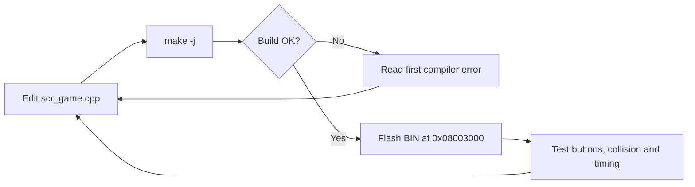

# Getting Started — Bug_Storm

This guide covers the complete workflow from source code to a flashable STM32L151 application image.

## 1. Requirements

### Target hardware

- AK Embedded Base Kit v3.
- STM32L151CBT6.
- 1.54-inch monochrome OLED.
- USB-UART connection for AK Bootloader, or an ST-Link programmer.

### Kali Linux packages

```bash
sudo apt update
sudo apt install -y \
    build-essential \
    make \
    gcc-arm-none-eabi \
    binutils-arm-none-eabi \
    libnewlib-arm-none-eabi \
    libstdc++-arm-none-eabi-newlib
```

Verify the tools:

```bash
arm-none-eabi-gcc --version
arm-none-eabi-g++ --version
make --version
```

## 2. Project layout

```text
chicken_invaders_1bit/
├── application/                 Application firmware at 0x08003000
│   ├── Makefile
│   └── sources/
├── boot/                        AK bootloader source
├── hardware/                    Board documentation and binaries
├── docs/                        Design documentation
└── README.md
```

The gameplay implementation is located at:

```text
application/sources/app/screens/scr_game.cpp
```

## 3. Build

```bash
cd ~/chicken_invaders_1bit/application
make clean
make -j"$(nproc)"
```

Successful completion includes the following stages:

```text
CC / CXX  Compile source files
LD        Link application image
OBJCOPY   Generate BIN/ELF/OUT files
SIZE      Print Flash and RAM usage
```

Expected output:

```text
application/build_bug-storm/
├── bug-storm.axf
├── bug-storm.bin
├── bug-storm.elf
├── bug-storm.map
└── bug-storm.out
```

## 4. Toolchain path issue

If Make reports that a GCC `14.2.1` library cannot be found, query the installed toolchain paths:

```bash
arm-none-eabi-gcc -print-libgcc-file-name
arm-none-eabi-gcc -print-file-name=libc.a
arm-none-eabi-g++ -print-file-name=libstdc++_nano.a
```

The Makefile library variables can be made version-independent:

```makefile
LIBC           = $(shell $(CC) $(CPU) $(FPU) -print-file-name=libc.a)
LIBM           = $(shell $(CC) $(CPU) $(FPU) -print-file-name=libm.a)
LIBFPU         = $(shell $(CC) $(CPU) $(FPU) -print-file-name=libg.a)
LIBSTDCPP_NANO = $(shell $(CPP) $(CPU) $(FPU) -print-file-name=libstdc++_nano.a)
LIBGCC         = $(shell $(CC) $(CPU) $(FPU) -print-libgcc-file-name)
LIBGCOV        = $(shell $(CC) $(CPU) $(FPU) -print-file-name=libgcov.a)
LIBRDPMON      =
```

## 5. Flash

The application partition starts at `0x08003000`.

```bash
ak-flash /dev/ttyUSB0 \
    build_bug-storm/bug-storm.bin \
    0x08003000
```

Or:

```bash
make flash dev=/dev/ttyUSB0
```

Check the serial device:

```bash
ls -l /dev/ttyUSB*
```

If access is denied:

```bash
sudo usermod -aG dialout "$USER"
```

Log out and back in before retrying.

## 6. Development loop



## 7. Troubleshooting checklist

| Symptom | Check |
|---|---|
| Compiler not found | Confirm `gcc-arm-none-eabi` is installed. |
| Library path error | Use the compiler `-print-file-name` commands above. |
| BIN is not generated | Find the first error before the linker stage. |
| Board does not boot | Confirm the application was flashed at `0x08003000`. |
| USB permission denied | Add the user to `dialout`. |
| Old behavior remains | Run `make clean` before rebuilding. |


