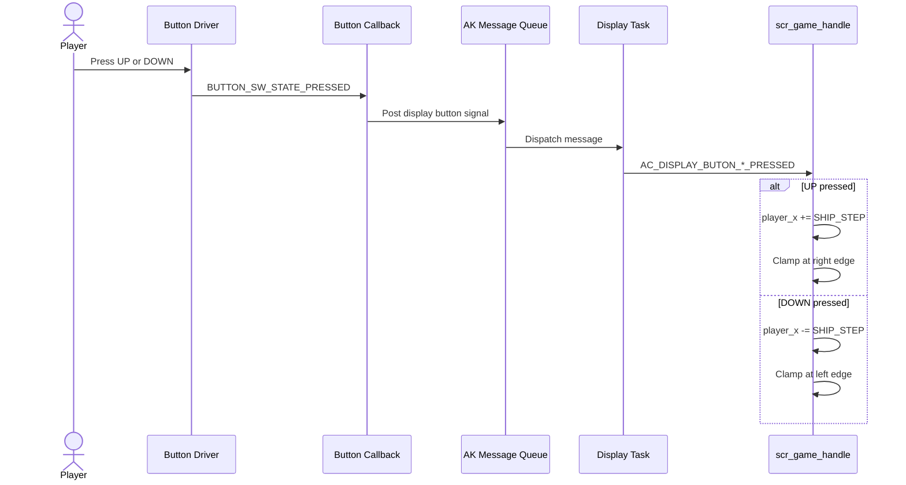
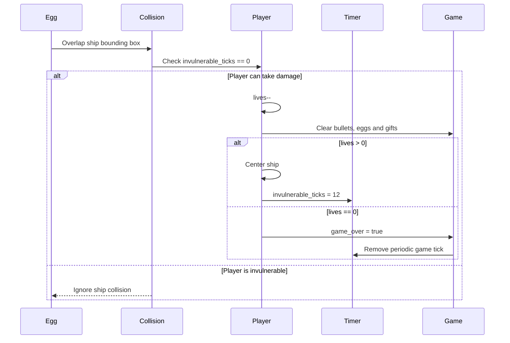
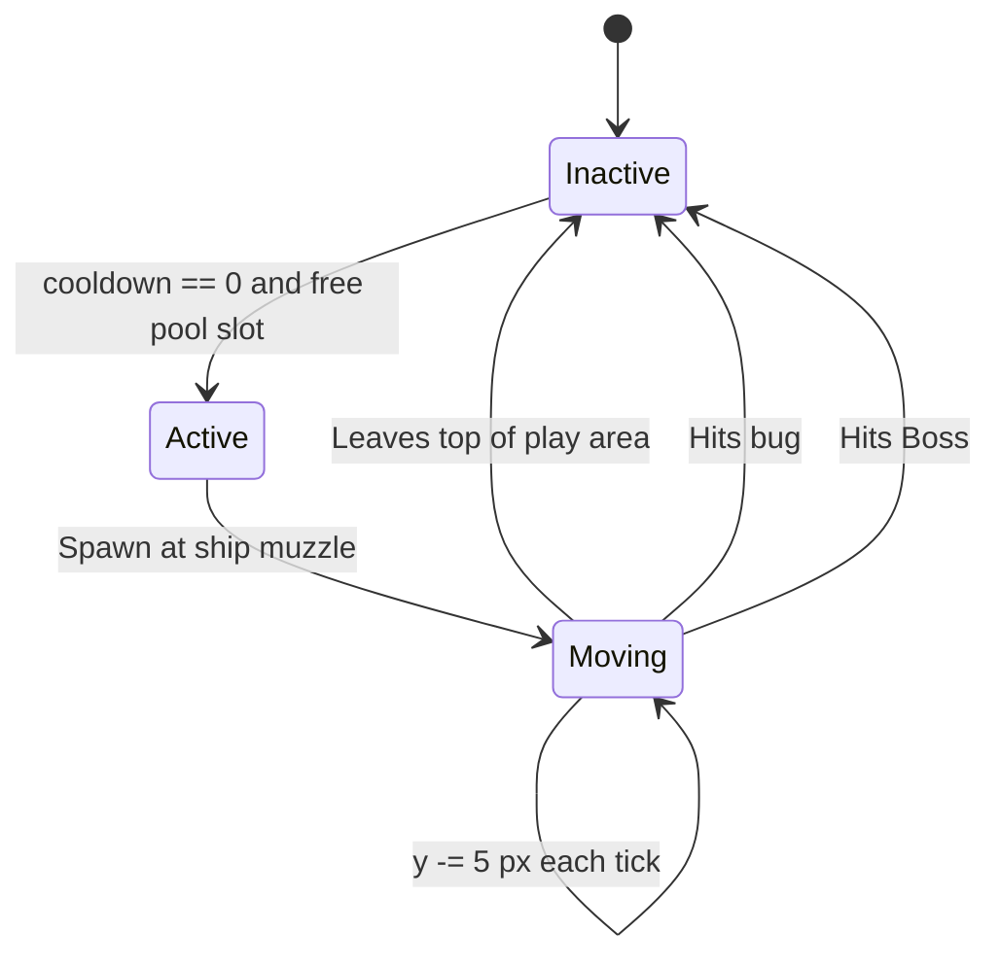
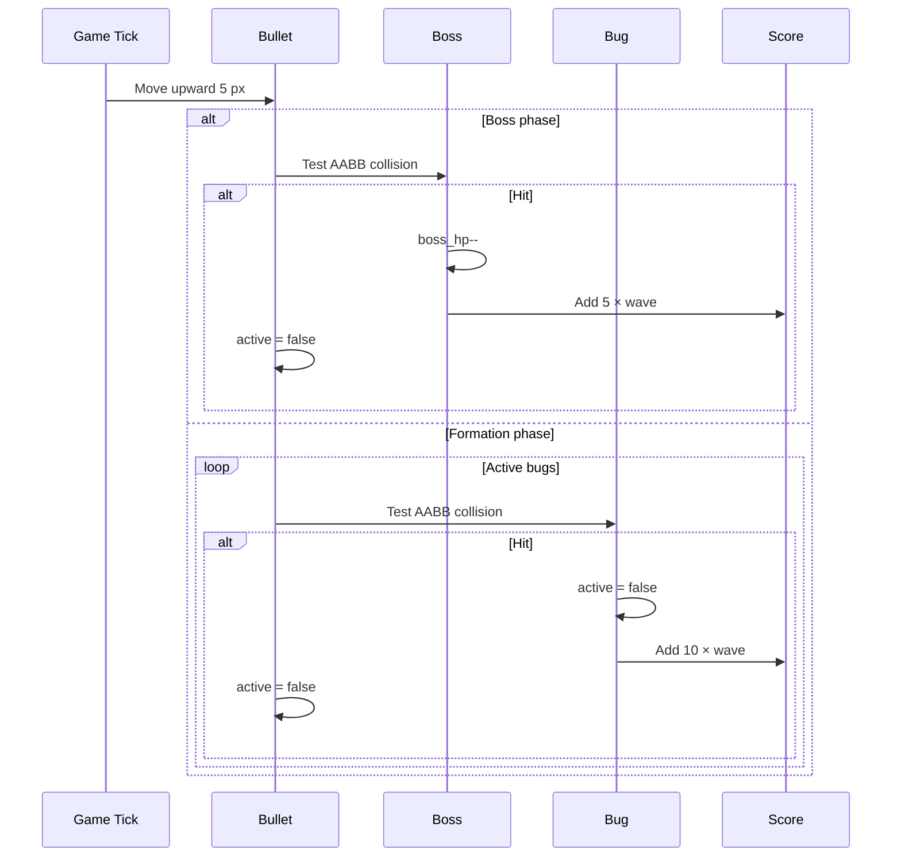
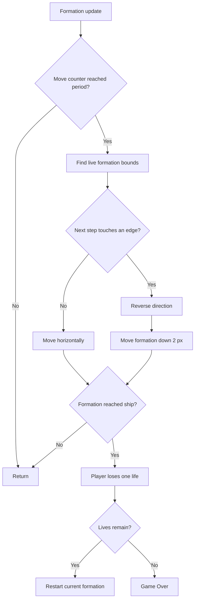
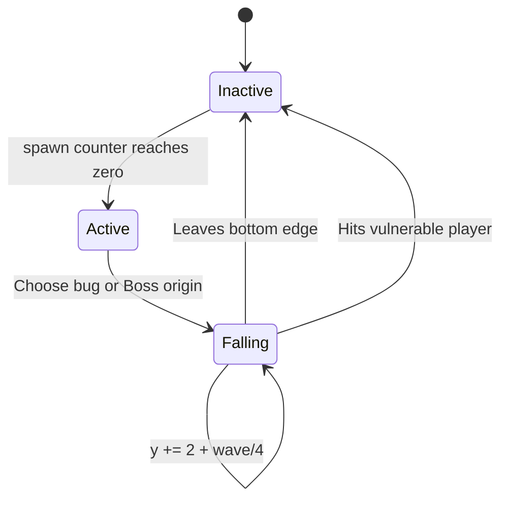
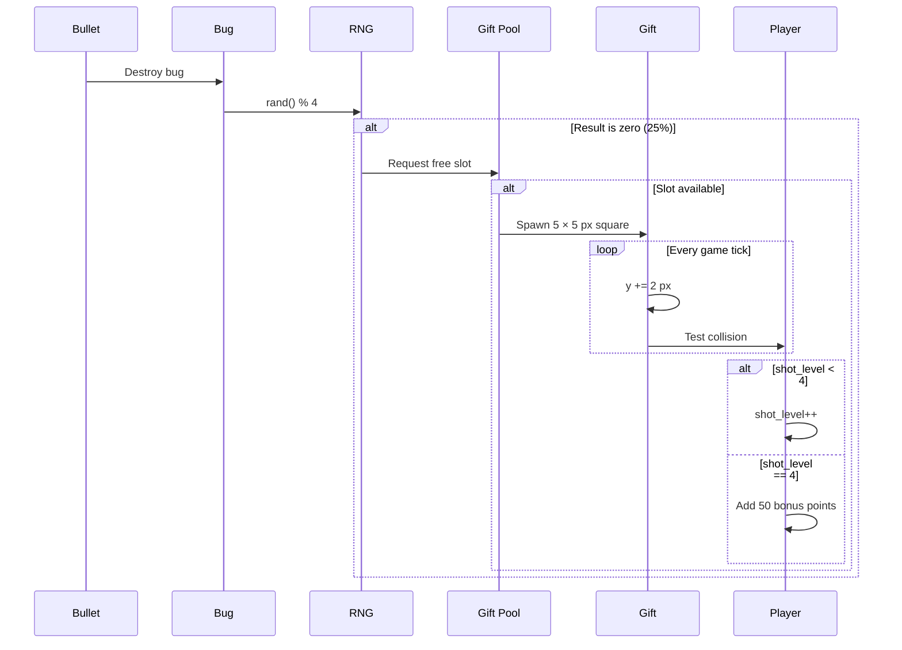
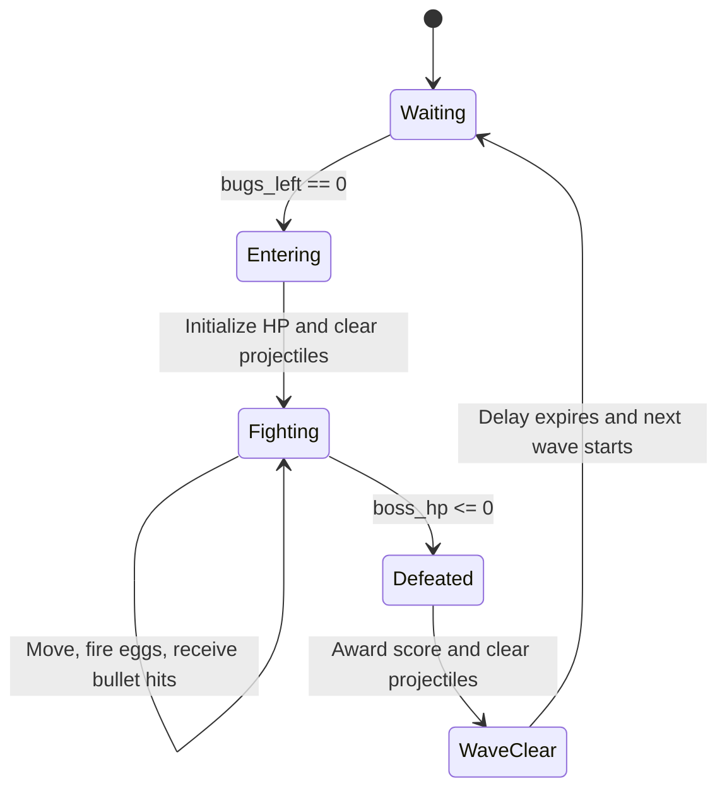
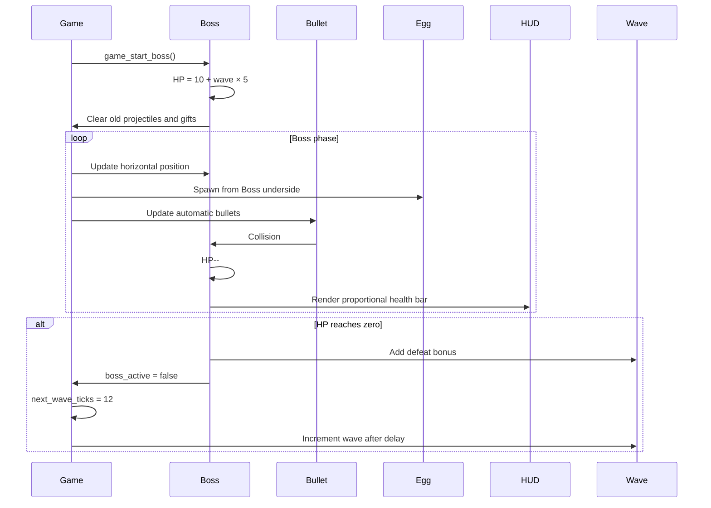

# Game Object Runtime Sequences

This document describes the lifecycle and interaction of each gameplay object.

## 1. Player Ship

### State

| Field | Meaning |
|---|---|
| `player_x` | Horizontal position. |
| `lives` | Remaining lives, initially 3. |
| `shot_level` | Number of automatic firing streams, from 1 to 4. |
| `fire_cooldown` | Ticks remaining until another volley can be created. |
| `invulnerable_ticks` | Damage protection and blink timer. |

### Input sequence



### Damage sequence



## 2. Automatic Bullet

### Volley pattern

Offsets are relative to the center of the ship:

| Firepower | Bullet X offsets |
|---:|---|
| `P:1` | `0` |
| `P:2` | `-3, +3` |
| `P:3` | `-5, 0, +5` |
| `P:4` | `-6, -2, +2, +6` |

### Lifecycle



### Collision sequence



## 3. Bug Formation

### Layout

```text
Rows             : 3
Columns          : 6
Bug size     : 10 × 7 px
Column step      : 16 px
Row step         : 10 px
Initial origin   : X=14, Y=11
```

### Movement sequence



## 4. Egg

An egg is emitted by the lowest living bug in a selected column. During Boss phase, the egg origin is a random horizontal point under the Boss body.



Only five eggs may exist at once. If the pool has no free slot, the spawn attempt is skipped.

## 5. Gift

### Drop and collection



Gift state is preserved only while it remains active in the current phase. Projectiles and gifts are cleared at formation/Boss phase transitions.

## 6. Boss

### State and scaling

| Property | Formula |
|---|---|
| Size | 30 × 18 px |
| Initial X | `(LCD_WIDTH - BOSS_WIDTH) / 2` |
| Initial Y | 15 px |
| Maximum HP | `10 + wave × 5` |
| Move period | `max(1, 2 - wave / 4)` ticks |
| Move step | `1 + wave / 4` px |
| Hit score | `5 × wave` |
| Defeat bonus | `100 × wave` |

### Boss lifecycle



### Boss fight sequence




