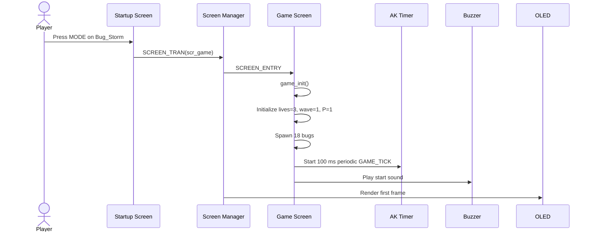
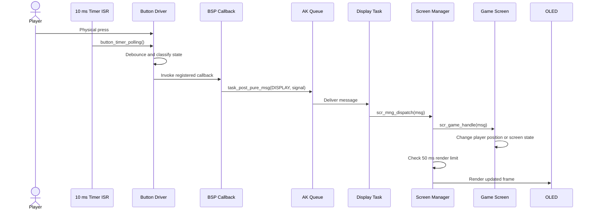
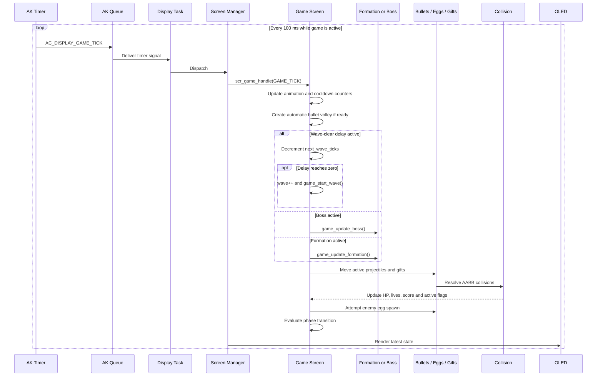
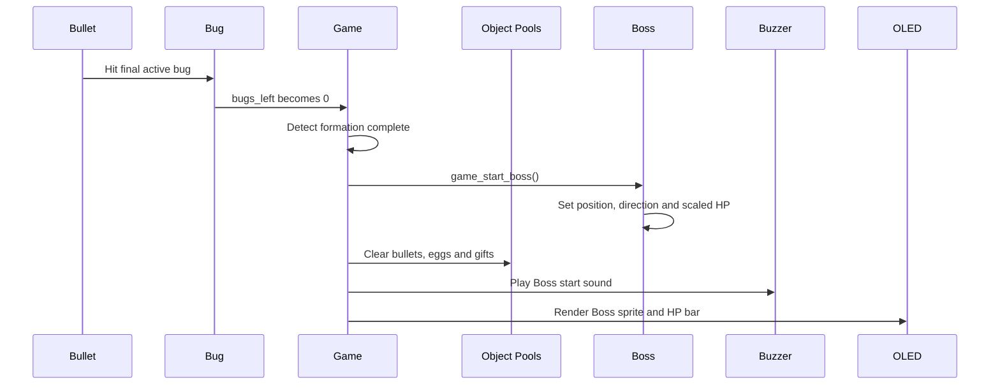
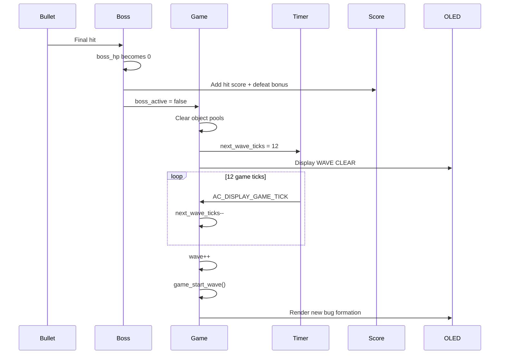
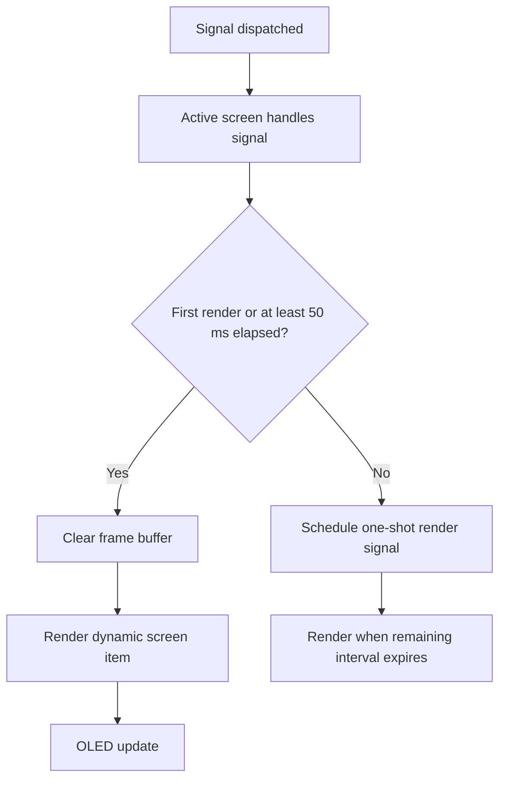

# Runtime Signal Processing and Game Loop

This document follows the complete runtime path from hardware input and software timers to state update and OLED rendering.

## 1. Main participants

| Participant | Responsibility |
|---|---|
| Hardware timer ISR | Calls button polling every 10 ms. |
| Button driver | Debounces buttons and identifies pressed/long-pressed states. |
| BSP callback | Converts button state into an AK display-task signal. |
| AK message queue | Transfers signals outside interrupt/polling context. |
| Display task | Sends messages to the active screen manager. |
| Screen manager | Dispatches the signal and rate-limits OLED rendering. |
| Game screen | Owns and updates all gameplay state. |
| OLED renderer | Draws the 1-bit frame and transfers it to the display. |

## 2. Game entry

## 3. Button signal path

### Button-to-signal mapping

| Physical event | Signal | Game action |
|---|---|---|
| UP pressed | `AC_DISPLAY_BUTON_UP_PRESSED` | Move right by 5 px and clamp. |
| DOWN pressed | `AC_DISPLAY_BUTON_DOWN_PRESSED` | Move left by 5 px and clamp. |
| MODE pressed | `AC_DISPLAY_BUTON_MODE_PRESSED` | Restart only when Game Over; fire is automatic. |
| MODE held | `AC_DISPLAY_BUTON_MODE_LONG_PRESSED` | Stop game timer and return to startup menu. |

## 4. Periodic game tick

## 5. Complete match state machine

```mermaid
stateDiagram-v2
    [*] --> Initializing: SCREEN_ENTRY
    Initializing --> Formation: Start Wave 1

    state Formation {
        [*] --> Moving
        Moving --> Moving: Bugs remain
        Moving --> PlayerHit: Egg hit or invasion
        PlayerHit --> Moving: Lives remain
        PlayerHit --> GameOver: Lives == 0
        Moving --> FormationClear: bugs_left == 0
    }

    FormationClear --> BossIntro: Initialize Boss

    state BossFight {
        [*] --> BossMoving
        BossMoving --> BossMoving: boss_hp > 0
        BossMoving --> PlayerHitBoss: Egg hits player
        PlayerHitBoss --> BossMoving: Lives remain
        PlayerHitBoss --> GameOver: Lives == 0
        BossMoving --> BossDefeated: boss_hp <= 0
    }

    BossIntro --> BossFight
    BossDefeated --> WaveClear
    WaveClear --> Formation: Delay expires; wave++
    GameOver --> Initializing: Short button press
    Formation --> Startup: Hold MODE
    BossFight --> Startup: Hold MODE
    GameOver --> Startup: Hold MODE
```

## 6. Formation-to-Boss transition

## 7. Boss-to-next-wave transition

## 8. Render scheduling

The game tick is 100 ms, while the screen manager allows rendering every 50 ms. Button events may therefore produce an intermediate render without changing the simulation tick rate.

## 9. Runtime invariants

- At most one enemy phase is active: formation or Boss.
- `boss_active` is false at the beginning of every normal wave.
- A new wave cannot start until Boss HP is zero and the clear delay expires.
- A projectile with `active == false` is ignored by update, collision and render code.
- `shot_level` remains between 1 and 4.
- Player X is always clamped to the screen bounds.
- The periodic game timer is removed on Game Over and when leaving the game screen.

